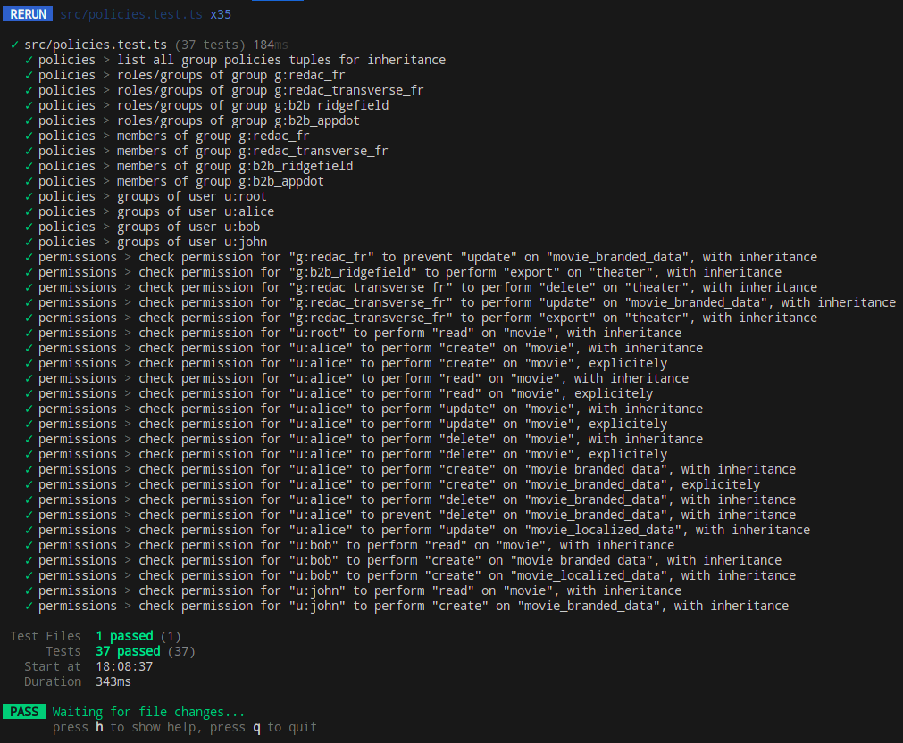

# Purpose

Validate that a set of [casbin rules](https://casbin.org/docs/overview/) can be saved in a PG database using a knex adapter.

The [casbin model](https://casbin.org/docs/supported-models) should implement those requirements (a mix of RBAC, ABAC):

- define a set of ressources
- define a set of permissions (actions) available on those ressources
- define a set of roles, based on general user profiles
- those roles should have access to those ressources via the permissions
- roles can inherit from other roles
- define a set of teams as groups, in order to assign users to their teams
- associate the groups to the required roles
- groups should be able to inherit from other groups
- define a set of users, associated to their groups
- users should not be able to inherit from other users
- users should be able to impersonate another users
- globally, permissions could be allowed or denied on specific ressources for specific objects (role, group, user)
- globally, permissions should be overrride-able at every level of inheritance

# Setup

```bash
make up; nmp i
```

# Run the app

Start the stack

```bash
make up;
```

Watch mode to properly load permissions in db

```bash
npm run dev
```

Running the tests

```bash
npm run test
```
And in watch mode

```bash
npm run test:watch
```

# Linting/formatting

```bash
npm run code:code:lint-fix; npm run code:prettify
```

# Output sample


